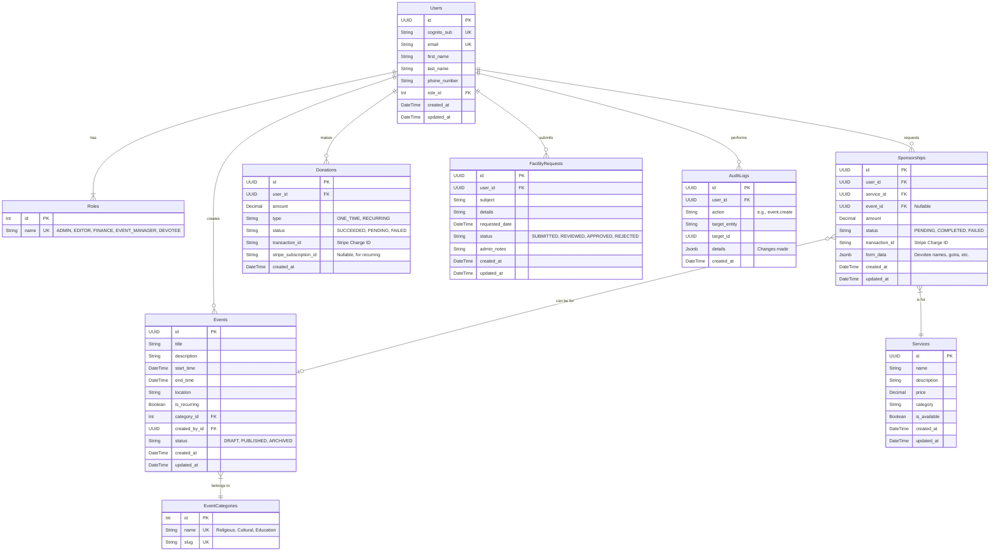

```markdown
# Entity Relationship Diagram (ERD)

| | |
|---|---|
| **Document Type** | Entity Relationship Diagram (ERD) |
| **Category** | Architecture |
| **Project** | Vishnu Mandir, Tampa |
| **Author** | Technical Writer AI |
| **Version** | 1.0 |
| **Date** | 2023-10-27 |

## 1. Introduction

### 1.1. Purpose

This document provides a detailed Entity Relationship Diagram (ERD) for the Vishnu Mandir, Tampa website project. Its primary purpose is to define the logical structure and relationships of the data entities required to support the application's core features. This ERD will serve as the blueprint for developing the database schema in **PostgreSQL**, using **Prisma** as the Object-Relational Mapper (ORM).

### 1.2. Scope

The ERD covers the following functional areas as defined in the project requirements:
- **User and Access Management**: Storing user information and their roles (Admin, Editor, etc.).
- **Content and Events**: Managing events, schedules, services, and categories.
- **Transactions**: Recording donations (one-time and recurring) and puja sponsorships.
- **Forms and Requests**: Capturing and tracking facility requests.
- **Auditing**: Logging administrative actions for security and accountability.

### 1.3. Database Rationale

**PostgreSQL** was chosen over DynamoDB to facilitate the complex queries and reporting required by the administrative backend. Features like exporting CSV reports on donations, sponsorships, and user activity are more efficiently handled by a relational database. The structure defined here is optimized for this purpose while maintaining performance for transactional operations.

## 2. ERD Diagram (Mermaid Syntax)

The following diagram illustrates the primary entities and their relationships.



## 3. Entity Definitions

This section provides a detailed breakdown of each table, its columns, data types, and constraints.

### 3.1. `Users`
Stores information about all individuals interacting with the site, from anonymous devotees to administrators. Authentication is handled by AWS Cognito, and this table links the Cognito user (`cognito_sub`) to an internal user profile and role.

| Column | Data Type | Constraints | Description |
|---|---|---|---|
| `id` | `UUID` | `PRIMARY KEY`, `DEFAULT gen_random_uuid()` | Unique identifier for the user. |
| `cognito_sub` | `VARCHAR(255)` | `UNIQUE`, `NOT NULL` | The unique subject claim from the Cognito JWT. |
| `email` | `VARCHAR(255)` | `UNIQUE`, `NOT NULL` | User's primary email address. |
| `first_name` | `VARCHAR(255)` | | User's first name. |
| `last_name` | `VARCHAR(255)` | | User's last name. |
| `phone_number` | `VARCHAR(50)` | | User's contact phone number. |
| `role_id` | `INTEGER` | `FOREIGN KEY` to `Roles(id)` | Defines the user's access level. |
| `created_at` | `TIMESTAMPTZ` | `NOT NULL`, `DEFAULT NOW()` | Timestamp of user creation. |
| `updated_at` | `TIMESTAMPTZ` | `NOT NULL`, `DEFAULT NOW()` | Timestamp of last user update. |

### 3.2. `Roles`
A lookup table for user roles to enforce Role-Based Access Control (RBAC). Using a separate table allows for future flexibility.

| Column | Data Type | Constraints | Description |
|---|---|---|---|
| `id` | `SERIAL` | `PRIMARY KEY` | Unique identifier for the role. |
| `name` | `VARCHAR(50)` | `UNIQUE`, `NOT NULL` | Name of the role (e.g., `ADMIN`, `EDITOR`, `FINANCE`). |

### 3.3. `Events`
Stores details for all scheduled activities, including pujas, cultural programs, classes, and festivals.

| Column | Data Type | Constraints | Description |
|---|---|---|---|
| `id` | `UUID` | `PRIMARY KEY`, `DEFAULT gen_random_uuid()` | Unique identifier for the event. |
| `title` | `VARCHAR(255)` | `NOT NULL` | The public name of the event. |
| `description` | `TEXT` | | Detailed information about the event. |
| `start_time` | `TIMESTAMPTZ` | `NOT NULL` | The start date and time of the event. |
| `end_time` | `TIMESTAMPTZ` | | The end date and time of the event. |
| `location` | `VARCHAR(255)` | `DEFAULT 'Vishnu Mandir, Tampa'` | Location of the event. |
| `is_recurring` | `BOOLEAN` | `NOT NULL`, `DEFAULT false` | Flag to indicate if this is a recurring event pattern. |
| `category_id` | `INTEGER` | `FOREIGN KEY` to `EventCategories(id)` | The category this event belongs to. |
| `created_by_id` | `UUID` | `FOREIGN KEY` to `Users(id)` | The admin user who created the event. |
| `status` | `VARCHAR(50)` | `NOT NULL`, `DEFAULT 'DRAFT'` | Publication status (e.g., `DRAFT`, `PUBLISHED`). |
| `created_at`| `TIMESTAMPTZ` | `NOT NULL`, `DEFAULT NOW()` | Timestamp of record creation. |
| `updated_at`| `TIMESTAMPTZ` | `NOT NULL`, `DEFAULT NOW()` | Timestamp of last record update. |

### 3.4. `EventCategories`
A lookup table to categorize events for filtering and display on the website.

| Column | Data Type | Constraints | Description |
|---|---|---|---|
| `id` | `SERIAL` | `PRIMARY KEY` | Unique identifier for the category. |
| `name` | `VARCHAR(100)` | `UNIQUE`, `NOT NULL` | The display name (e.g., 'Religious', 'Cultural'). |
| `slug` | `VARCHAR(100)` | `UNIQUE`, `NOT NULL` | URL-friendly identifier (e.g., 'religious'). |

### 3.5. `Services`
A catalog of pujas and other religious services offered by the temple, including their standard prices.

| Column | Data Type | Constraints | Description |
|---|---|---|---|
| `id` | `UUID` | `PRIMARY KEY`, `DEFAULT gen_random_uuid()` | Unique identifier for the service. |
| `name` | `VARCHAR(255)` | `NOT NULL` | The name of the puja or service. |
| `description` | `TEXT` | | Detailed description of the service. |
| `price` | `DECIMAL(10, 2)` | `NOT NULL` | The standard cost of the service. |
| `category` | `VARCHAR(100)`| | Category for internal grouping (e.g., 'In-Temple', 'Off-site'). |
| `is_available` | `BOOLEAN` | `NOT NULL`, `DEFAULT true` | Toggles visibility/availability of the service. |
| `created_at`| `TIMESTAMPTZ` | `NOT NULL`, `DEFAULT NOW()` | Timestamp of record creation. |
| `updated_at`| `TIMESTAMPTZ` | `NOT NULL`, `DEFAULT NOW()` | Timestamp of last record update. |

### 3.6. `Sponsorships`
Records a transaction where a user sponsors a specific `Service`, optionally tied to an `Event`.

| Column | Data Type | Constraints | Description |
|---|---|---|---|
| `id` | `UUID` | `PRIMARY KEY`, `DEFAULT gen_random_uuid()` | Unique identifier for the sponsorship record. |
| `user_id` | `UUID` | `FOREIGN KEY` to `Users(id)` | The user who made the sponsorship. |
| `service_id` | `UUID` | `FOREIGN KEY` to `Services(id)` | The service being sponsored. |
| `event_id` | `UUID` | `FOREIGN KEY` to `Events(id)`, `NULLABLE` | Optional: The event this sponsorship is for. |
| `amount` | `DECIMAL(10, 2)` | `NOT NULL` | The final amount paid. |
| `status` | `VARCHAR(50)` | `NOT NULL` | Payment status from Stripe (`PENDING`, `COMPLETED`). |
| `transaction_id` | `VARCHAR(255)` | `UNIQUE` | The transaction ID from Stripe for reconciliation. |
| `form_data` | `JSONB` | | Flexible field to store submitted form data (names, etc.). |
| `created_at`| `TIMESTAMPTZ` | `NOT NULL`, `DEFAULT NOW()` | Timestamp of record creation. |
| `updated_at`| `TIMESTAMPTZ` | `NOT NULL`, `DEFAULT NOW()` | Timestamp of last record update. |

### 3.7. `Donations`
Records all one-time and recurring donations made through the website.

| Column | Data Type | Constraints | Description |
|---|---|---|---|
| `id` | `UUID` | `PRIMARY KEY`, `DEFAULT gen_random_uuid()` | Unique identifier for the donation record. |
| `user_id` | `UUID` | `FOREIGN KEY` to `Users(id)` | The user who made the donation. |
| `amount` | `DECIMAL(10, 2)` | `NOT NULL` | The amount donated. |
| `type` | `VARCHAR(50)` | `NOT NULL` | `ONE_TIME` or `RECURRING`. |
| `status`| `VARCHAR(50)` | `NOT NULL` | Payment status from Stripe (`SUCCEEDED`, `FAILED`). |
| `transaction_id`|`VARCHAR(255)`| `UNIQUE`, `NOT NULL` | The Stripe Charge ID. |
| `stripe_subscription_id` | `VARCHAR(255)` | `UNIQUE`, `NULLABLE` | The Stripe Subscription ID for recurring donations. |
| `created_at`| `TIMESTAMPTZ` | `NOT NULL`, `DEFAULT NOW()` | Timestamp of record creation. |

### 3.8. `FacilityRequests`
Stores submissions from the "Facility Request" form.

| Column | Data Type | Constraints | Description |
|---|---|---|---|
| `id` | `UUID` | `PRIMARY KEY`, `DEFAULT gen_random_uuid()` | Unique identifier for the request. |
| `user_id` | `UUID` | `FOREIGN KEY` to `Users(id)` | The user who submitted the request. |
| `subject` | `VARCHAR(255)` | `NOT NULL` | The purpose of the request. |
| `details` | `TEXT` | `NOT NULL` | Full details provided by the user. |
| `requested_date`| `TIMESTAMPTZ`| | The date the user is requesting the facility for. |
| `status` | `VARCHAR(50)` | `NOT NULL`, `DEFAULT 'SUBMITTED'`| The current status of the request. |
| `admin_notes` | `TEXT` | | Notes added by an administrator during review. |
| `created_at`| `TIMESTAMPTZ` | `NOT NULL`, `DEFAULT NOW()` | Timestamp of record creation. |
| `updated_at`| `TIMESTAMPTZ` | `NOT NULL`, `DEFAULT NOW()` | Timestamp of last record update. |

### 3.9. `AuditLogs`
Tracks significant actions performed by administrators for security and accountability.

| Column | Data Type | Constraints | Description |
|---|---|---|---|
| `id` | `UUID` | `PRIMARY KEY`, `DEFAULT gen_random_uuid()` | Unique identifier for the log entry. |
| `user_id` | `UUID` | `FOREIGN KEY` to `Users(id)` | The user who performed the action. |
| `action` | `VARCHAR(100)`| `NOT NULL` | The action performed (e.g., `event.update`). |
| `target_entity`| `VARCHAR(100)`| | The table/entity that was affected (e.g., 'Events'). |
| `target_id` | `UUID` | | The ID of the record that was affected. |
| `details` | `JSONB` | | A snapshot of the data that was changed. |
| `created_at`| `TIMESTAMPTZ` | `NOT NULL`, `DEFAULT NOW()` | Timestamp of when the action occurred. |

## 4. Design Considerations

- **Primary Keys**: `UUID` is used as the primary key for most tables. This prevents enumeration attacks, simplifies data federation if needed in the future, and works well in distributed systems. Simple lookup tables like `Roles` use `SERIAL` for simplicity.
- **Timestamps**: All timestamp fields use the `TIMESTAMPTZ` (timestamp with time zone) data type. This is a best practice that stores the timestamp in UTC and converts it to the client's local time zone upon retrieval, preventing ambiguity.
- **Flexible Form Data**: The `Sponsorships` table includes a `JSONB` column (`form_data`). This provides schema-less flexibility to store various custom fields required for different puja sponsorships (e.g., "Name of Devotee," "Gotra," "Nakshatra") without altering the database schema.
- **Recurring Payments**: The `Donations` table accommodates recurring donations by storing the `stripe_subscription_id`. The application backend will listen for Stripe webhooks (`invoice.payment_succeeded`) to create new donation records for each successful recurring payment, linked to the original subscription.
- **Soft Deletes**: This schema does not implement soft deletes (e.g., an `is_deleted` flag). Instead, entities like `Events` have a `status` field (`ARCHIVED`) to remove them from public view while preserving the record for historical purposes. Direct deletion will be a destructive, audited operation.
```