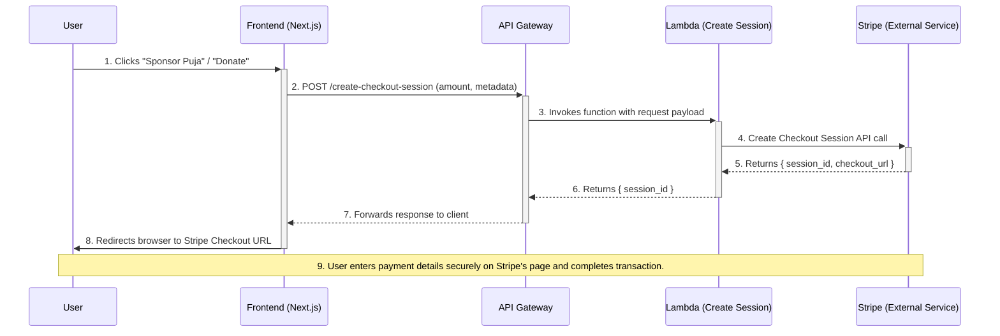

```markdown
# Sequence Diagrams

| | |
| :--- | :--- |
| **Project** | Vishnu Mandir, Tampa |
| **Document Type** | Sequence Diagrams |
| **Category** | Architecture |
| **Status** | **Draft** |

## 1. Overview

This document provides sequence diagrams to clarify complex, multi-step interactions within the Vishnu Mandir website's architecture. The primary goal is to offer a clear, step-by-step visual representation of how different components (user, frontend, backend services, and third-party APIs) communicate to complete a process.

These diagrams are essential for developers to understand the flow of data, identify potential failure points, and ensure the implementation aligns with the architectural design. The focus of this document is the "Puja Sponsorship" and "Donation" flow, which involves a user-initiated payment, processing via Stripe, and asynchronous confirmation via webhooks.

### Participants in the Flow

The following actors and system components are involved in the payment and confirmation sequence:

*   **User**: The devotee interacting with the website in their browser.
*   **Frontend (Next.js on Amplify)**: The client-side application that the user sees and interacts with.
*   **API Gateway**: The AWS service that acts as the front door for our backend logic, routing requests to the appropriate Lambda function.
*   **Lambda (Create Session)**: A serverless function responsible for creating a secure Stripe Checkout session.
*   **Stripe (External Service)**: The third-party payment processor. This includes both its API and its hosted checkout page.
*   **Lambda (Webhook Handler)**: A dedicated serverless function that listens for and processes asynchronous events from Stripe (e.g., payment success).
*   **Database (PostgreSQL)**: The database used to store transaction records, sponsorship details, and donor information.
*   **SES (Simple Email Service)**: The AWS service used to send transactional emails, such as payment receipts and admin notifications.

---

## 2. Diagram 1: Payment Initiation Flow

This sequence illustrates the steps from the user initiating a payment on the website to being redirected to the secure Stripe Checkout page. This is a synchronous flow from the user's perspective.

### Steps:

1.  **Initiate Payment**: The User clicks a "Donate" or "Sponsor Puja" button on the Next.js frontend.
2.  **Request Checkout Session**: The frontend sends a POST request containing payment details (e.g., amount, currency, sponsorship ID) to the `/create-checkout-session` endpoint on our API Gateway.
3.  **Trigger Lambda**: API Gateway invokes the "Create Session" Lambda function, passing along the request data.
4.  **Create Stripe Session**: The Lambda function validates the incoming data and makes a secure, server-to-server API call to Stripe to create a Checkout Session. This request includes success and cancellation URLs.
5.  **Receive Session ID**: Stripe's API validates the request, creates the session, and returns a unique `session_id` and a `checkout_url`.
6.  **Return Session ID**: The Lambda function returns the `session_id` to the API Gateway.
7.  **Forward to Frontend**: API Gateway forwards the response to the frontend application.
8.  **Redirect to Stripe**: The frontend uses the `session_id` and Stripe's client-side JavaScript library (`stripe.redirectToCheckout()`) to securely redirect the User's browser to the Stripe-hosted payment page.
9.  **Complete Payment**: The User enters their payment information directly on the secure Stripe page. Our website never handles or sees raw credit card data.

### Mermaid Diagram



---

## 3. Diagram 2: Asynchronous Payment Confirmation (Webhook)

This sequence is the most critical for data integrity and reliability. It is an **asynchronous, out-of-band** process that occurs after the user has completed payment on Stripe's site. It ensures that we have a persistent record of the transaction and that both the user and administrators are notified, regardless of whether the user returns to our website.

### Steps:

1.  **Payment Success Event**: After the user successfully pays, Stripe's system generates a `checkout.session.completed` event.
2.  **Send Webhook**: Stripe sends a signed POST request containing the event payload to a pre-configured webhook endpoint on our API Gateway (e.g., `/stripe-webhook`).
3.  **Trigger Webhook Lambda**: API Gateway receives the request and invokes the dedicated "Webhook Handler" Lambda function.
4.  **Verify Signature**: **(Security Critical)** The Lambda function first verifies the `Stripe-Signature` header from the request. This confirms the webhook is authentic and came from Stripe, preventing forgery. If verification fails, the process stops and returns an error.
5.  **Process Event**: The Lambda parses the event data to extract key information like the customer's email, the amount paid, and any custom metadata (e.g., `puja_id`, `donation_type`).
6.  **Save Transaction**: The Lambda function creates a record in the PostgreSQL database with the transaction details. This should be an idempotent operation (i.e., it should not create a duplicate record if Stripe sends the same event twice).
7.  **Send User Confirmation**: The Lambda invokes AWS SES to send a "Thank You" / receipt email to the user's email address (retrieved from the Stripe event).
8.  **Send Admin Notification**: The Lambda also invokes AWS SES to send a notification email to the relevant internal team (e.g., `finance@vishnumandirtampa.org`) with details of the new sponsorship or donation.
9.  **Acknowledge Webhook**: The Lambda function returns a `200 OK` status code to Stripe. This tells Stripe that the event has been successfully received and processed. If Stripe does not receive a 200 response, it will automatically retry sending the webhook.

### Mermaid Diagram

```mermaid
sequenceDiagram
    participant Stripe (External Service)
    participant API Gateway
    participant Lambda (Webhook Handler)
    participant Database (PostgreSQL)
    participant SES (Email Service)
    participant User
    participant Admin

    Stripe (External Service)->>+API Gateway: 1, 2. POST /stripe-webhook (event: 'checkout.session.completed')
    API Gateway->>+Lambda (Webhook Handler): 3. Invokes function with webhook payload

    Lambda (Webhook Handler)->>Lambda (Webhook Handler): 4. **Verify webhook signature**
    Lambda (Webhook Handler)->>+Database (PostgreSQL): 5, 6. Save transaction record (idempotent)
    Database (PostgreSQL)-->>-Lambda (Webhook Handler): Returns success/failure

    Lambda (Webhook Handler)->>+SES (Email Service): 7. Send receipt email to User
    SES (Email Service)-->>User: Delivers email

    Lambda (Webhook Handler)->>+SES (Email Service): 8. Send notification email to Admin
    SES (Email Service)-->>Admin: Delivers email
    deactivate SES (Email Service)

    Lambda (Webhook Handler)-->>-API Gateway: 9. Returns 200 OK
    API Gateway-->>-Stripe (External Service): Forwards 200 OK response
    deactivate API Gateway
```

---

## 4. Key Architectural Considerations

*   **Decoupled Confirmation**: The frontend's "success page" is only a temporary confirmation for good user experience. The authoritative source of truth is the webhook-driven process. This ensures that even if the user closes their browser after paying, the transaction is still recorded and confirmed correctly.
*   **Webhook Security**: The verification of the Stripe webhook signature is non-negotiable. It protects the system from malicious actors attempting to create fake transactions by calling the webhook endpoint directly. The signing secret must be stored securely (e.g., in AWS Secrets Manager) and not committed to the code repository.
*   **Idempotency**: Webhook endpoints must be idempotent. Network issues can cause Stripe to re-send the same event. The handler logic should check if a transaction for a given `event.id` or `payment_intent_id` has already been processed before creating new database entries or sending duplicate emails.
*   **Separation of Concerns**: Using two distinct Lambda functions (`Create Session` and `Webhook Handler`) follows the principle of least privilege. The session creation function only needs permissions to talk to Stripe's Checkout API, while the webhook handler needs permissions to write to the database and send emails via SES. This separation enhances security and maintainability.

```